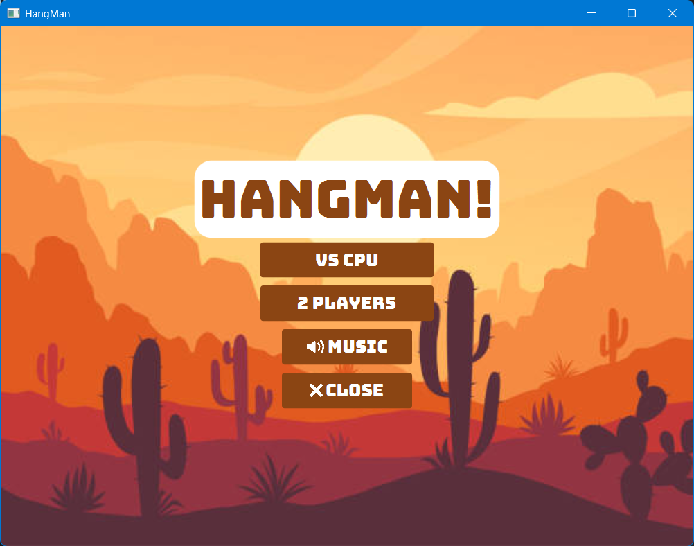
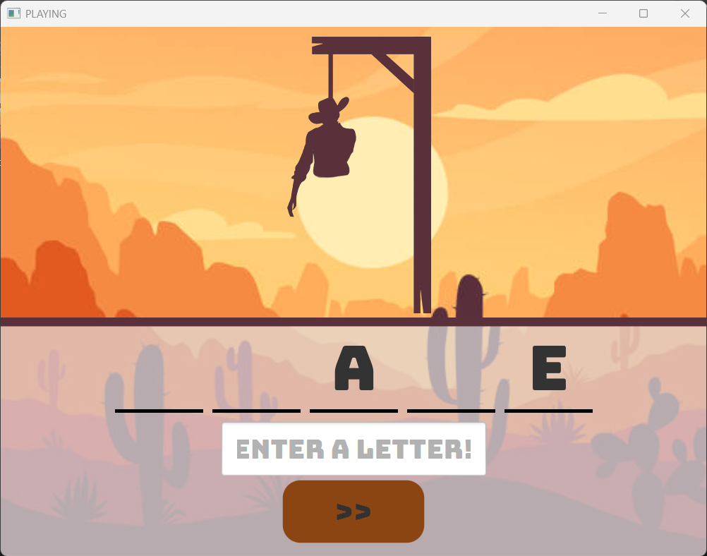
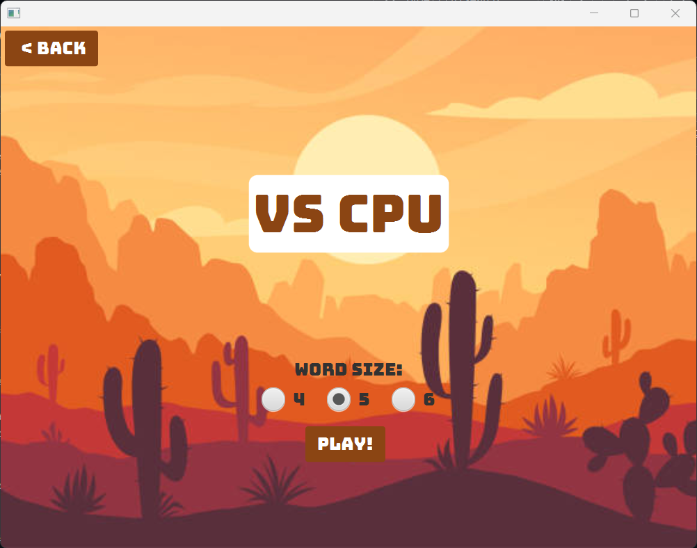
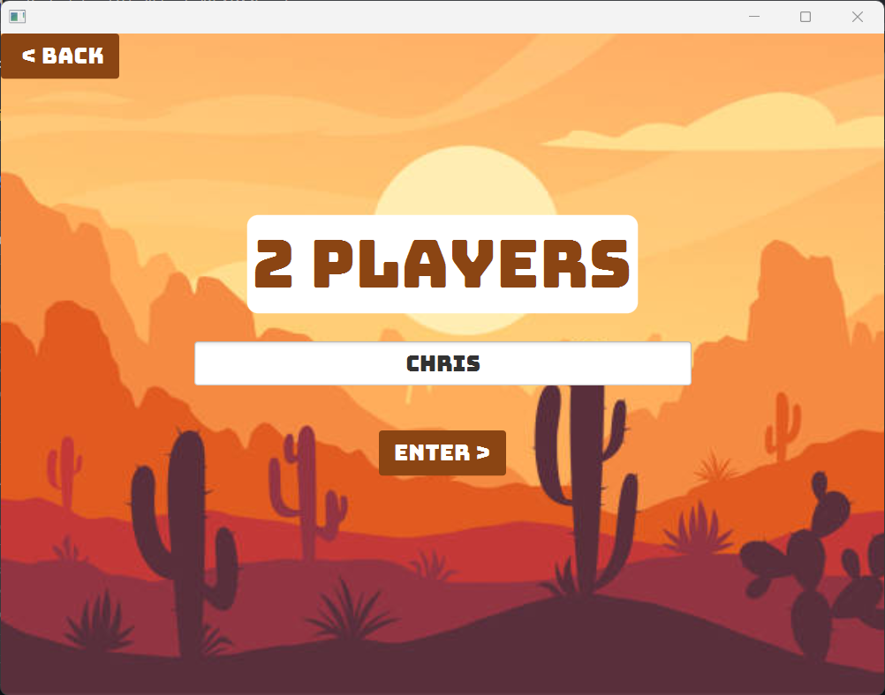
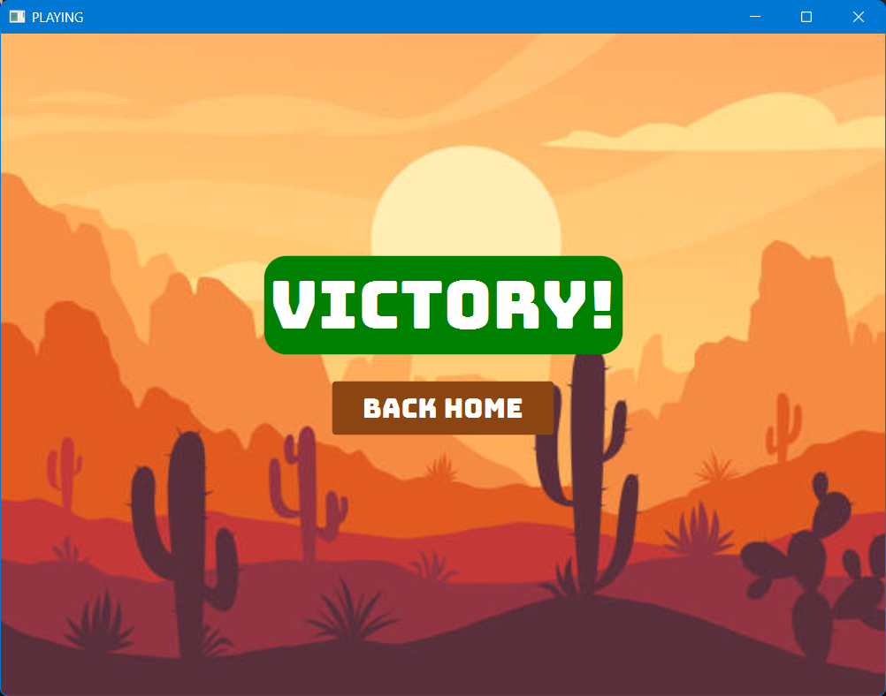
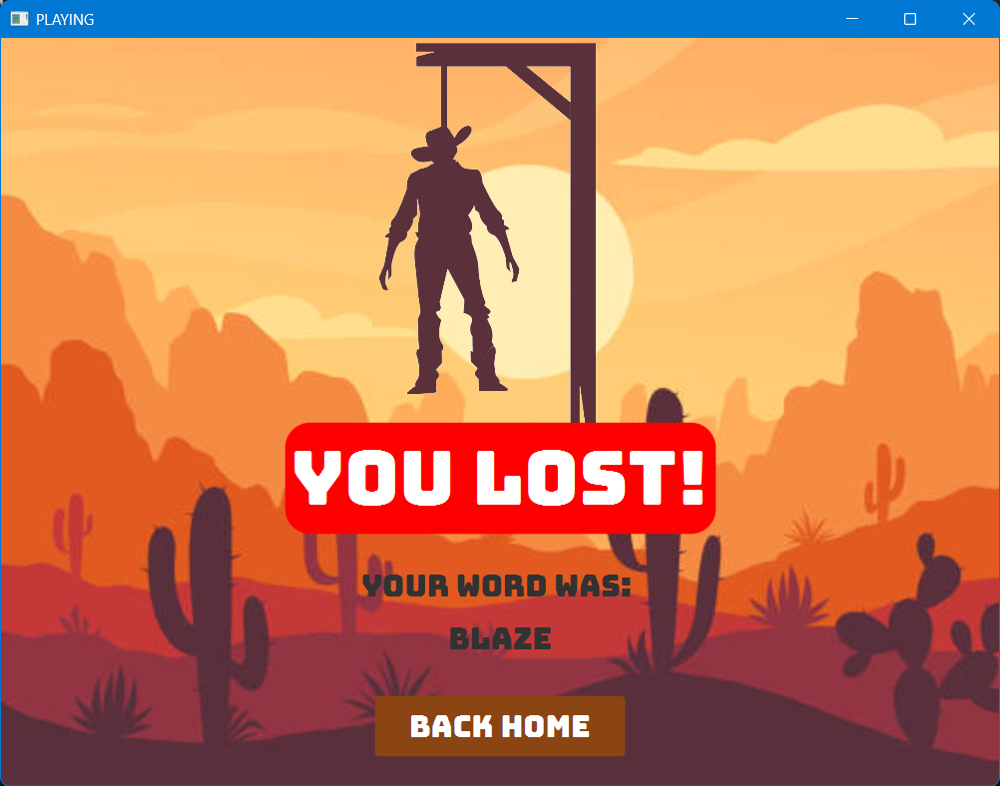

# Hang-Man-Project-JavaFX
An OOP course university final project

# 🎮 Hangman Game (JavaFX)

A fully interactive **Hangman game** built using **JavaFX**, featuring multiple game modes, custom UI design, and audio integration. This project was developed as part of an Object-Oriented Programming assignment.

---

## 🏷️ Badges

---

## 🚀 Features

- 🤖 **VS CPU Mode**
  - Random word generation
  - Select word length (4, 5, or 6 letters)

- 👥 **2 Players Mode**
  - One player inputs a word (3–7 letters)
  - Second player guesses

- 🎨 **Modern UI**
  - JavaFX layouts (`VBox`, `HBox`, `StackPane`, `BorderPane`)
  - Custom fonts and styled buttons
  - Background images

- 🔊 **Audio System**
  - Background music (toggle on/off)
  - Sound effects (click, win, loss)

- 🧠 **Game Logic**
  - Tracks used letters
  - Input validation (letters only)
  - Progressive hangman drawing
  - Win/Loss detection screens

---

## 🧠 How It Works

- A word is either randomly generated (CPU) or entered by a player
- Letters are hidden and displayed as blanks
- Player guesses one letter at a time
- Correct guesses reveal letters
- Wrong guesses draw the hangman
- Game ends when:
  - ✅ Word is fully guessed → **Victory**
  - ❌ Max wrong guesses reached → **Loss**

---

## 📸 Screenshots

### 🏠 Home Screen

### 🎮 Gameplay

### 🤖 VS CPU Screen

### 👥 2 Players Mode

### 🏆 Victory Screen

### ❌ Loss Screen

---

## 🛠️ Technologies Used

- **Java**
- **JavaFX**
- **Java Media API**
- **OOP Principles**

---

## 📂 Project Structure
src/
└── com/example/projectoop/
└── HangManProject.java

resources/
├── images/
├── audios/
└── fonts/
